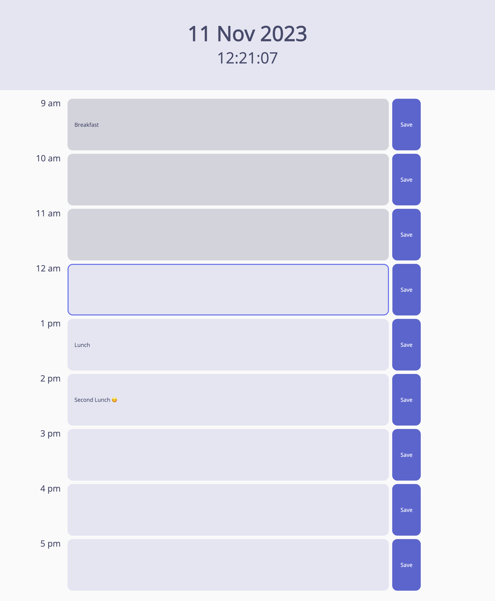

# Plan Your Day

A daily planner that allows the user to save events for each hour of the day.

## Description

This is a simple calendar application that allows the user to save events for each hour of the day. This app runs in the browser and features dynamically updated HTML and CSS powered by jQuery.

- The current day is displayed at the top of the calendar.
- Timeblocks for standard business hours are displayed.
- Each timeblock is color coded to indicate whether it is in the past, present, or future.
- When the user clicks into a timeblock, they can enter an event.
- When the user clicks the save button for that timeblock, the text for that event is saved in local storage.
- When the user refreshes the page, the saved events persist.

## Usage

The deployed planner can be found [here](https://annabrisland.github.io/daily-planner).

## License

[MIT](https://choosealicense.com/licenses/mit/)